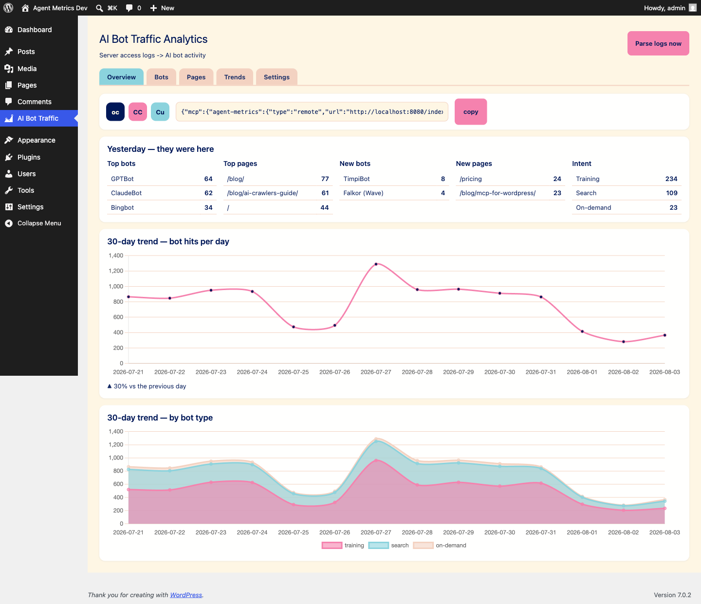
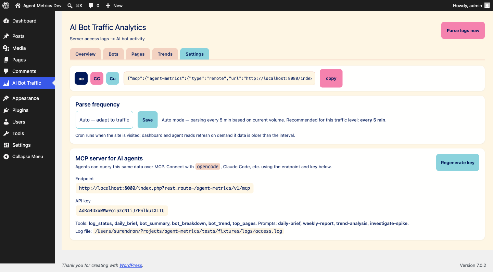

# Agent Ready

**Make your WordPress site agent-ready with Markdown twins, dynamic llms.txt, and WebMCP, while tracking AI crawler traffic and bot intent from access logs.**

Agent Ready transforms WordPress into native infrastructure for the agentic web. It arms your site with markdown twins (`/{slug}.md`), dynamic `llms.txt`, and a W3C WebMCP bridge for browser assistants, while providing granular, zero-overhead intelligence into how 42+ AI bots (GPTBot, ClaudeBot, PerplexityBot, etc.) crawl and consume your content.

The plugin keeps all data local to your WordPress site. It does not send logs or content to a third-party analytics service.

## Why This Exists

AI crawlers are already hitting public websites, but ordinary analytics reports them as anonymous bot traffic. That hides the useful questions:

- Which AI companies are visiting?
- Are they training models, indexing search, or answering a user right now?
- Which pages are attracting attention?
- Did a new bot or page appear yesterday?
- Is traffic growing because of a crawl, a search index refresh, or an assistant fetch?

Agent Metrics answers those questions from the access log your server already produces.

## Dashboard

The WordPress admin screen includes:

- Top bots and top pages for the latest activity day.
- Newly detected bots and newly crawled pages.
- Intent totals for training, search, and on-demand traffic.
- A 30-day AI bot traffic line chart.
- A 30-day stacked chart grouped by intent.
- A full bot table with category filters.
- Parse status, log diagnostics, and recommended refresh frequency.

The chart library is vendored in the plugin. The dashboard does not depend on a CDN.





## Agent-Ready Surfaces

Every published page answers to agents in two shapes. The HTML page humans see, and a markdown twin agents read (v0.5.0):

- `/{slug}.md` — the page as clean markdown with frontmatter (title, canonical URL, date).
- `Accept: text/markdown` on the regular `/{slug}/` URL returns the same markdown; browsers keep getting HTML (`Vary: Accept` does the negotiation).
- `Link` headers on the HTML page advertise both: `rel="alternate" type="text/markdown"` and `rel="describedby"` pointing at `/llms.txt`.

The markdown carries `X-Robots-Tag: noindex` so search engines keep ranking the HTML original.

Site-level surfaces:

- `/llms.txt` and `/.well-known/llms.txt` — a site map written for agents. Ordering comes from real agent activity (which pages actually get fetched), with manual pins (Settings → Agent Activity) that always lead. Hard cap: 100 pages.
- `/llms-full.txt` — every listed page in full markdown, separated by `<!-- page: slug -->` comments.

All of this is recorded as measurement — see Agent Activity Measurement below.

## WebMCP Bridge

The plugin ships a small script (`assets/js/webmcp-bridge.js`) that registers 3 read-only tools on `document.modelContext` (the W3C WebMCP API — Chrome preview today):

- `get_page_content` — the current page as markdown.
- `search_site` — WordPress search (titles, URLs, excerpts).
- `get_site_map` — the llms.txt site map.

It is progressive enhancement: browsers without `document.modelContext` get a no-op, and nothing changes for human visitors. Every execution beacons `POST /wp-json/agent-metrics/v1/agent-activity` (rate-limited to 60 requests/minute per IP), so you see which tools in-browser agents actually run.

One quirk if you test from Chrome DevTools: the WebMCP pane passes `executeTool` arguments as a JSON-encoded string rather than an object. `search_site` expects `{ query: "..." }` — parse the string before calling.

## Agent Activity Measurement

v0.5.0 adds a second measurement layer next to the access-log parsing. Intent `agent-activity` records two kinds of events in the same `wp_agent_metrics_hits` table:

- **Inferred** — a request to `/{slug}.md` lands as `MarkdownFetch`; a download of `/llms.txt` lands as `LlmsTxt`.
- **Declared** — a WebMCP execution lands as `WebMCP:{tool}` (e.g. `WebMCP:search_site`), beaconed by the browser itself.

Where it shows up:

- The dashboard gains an **Agent Activity** section: counters, by-tool table, per-page table, 30-day trend. It renders independently of access-log health — the section works even when the log reader finds nothing.
- The MCP endpoint gains a 7th tool, `agent_activity_summary` (totals, by tool, by page, daily trend; optional `days` argument, default 30).

Toggle it per site under **AI Bot Traffic → Settings → Agent Activity** (default: on).

## Install

### WordPress admin

1. Download the repository as a ZIP from [GitHub](https://github.com/surendranb/agent-metrics).
2. In WordPress, open **Plugins → Add New → Upload Plugin**.
3. Upload the ZIP and activate **AI Bot Traffic Analytics**.
4. Open **AI Bot Traffic** in the admin menu.

### Server

```bash
cd wp-content/plugins
git clone https://github.com/surendranb/agent-metrics.git agent-metrics
```

Activate the plugin in WordPress, then open the **AI Bot Traffic** screen.

## Log Discovery

The plugin checks these locations in order:

1. `AM_LOG_PATH`, when defined in `wp-config.php`.
2. `AM_LOG_DIR`, when defined in `wp-config.php`.
3. `/home/<user>/logs/access*` for cPanel hosts.
4. `/var/log/nginx/access*`.
5. `/var/log/apache2/access*`.
6. `/var/log/httpd/access*`.

For a managed host, define the exact readable file path in `wp-config.php` before the WordPress bootstrap:

```php
define( 'AM_LOG_PATH', '/home/example/logs/access.log' );
```

The web-server user must be able to read the file. Open **AI Bot Traffic → Diagnostics** to see every path tested and why it was accepted or rejected.

## Supported Log Shape

The parser accepts common Apache/Nginx access-log lines, including timezone-aware timestamps. The request method, path, status code, and final quoted field are used to identify the user agent.

Example:

```text
203.0.113.42 - - [04/Aug/2026:09:15:00 +0530] "GET /docs/ HTTP/1.1" 200 8123 "-" "GPTBot/1.1 (+https://openai.com/gptbot)"
```

Cloudflare dashboard exports are not read directly. Use an origin access log or a normalized log file that preserves the request timestamp, path, status, and user agent.

## MCP Server

The plugin exposes a protected JSON-RPC MCP endpoint so an AI agent can query the same rollup shown in WordPress.

After activation, open **AI Bot Traffic → Settings** and copy the endpoint and generated API key. The endpoint is:

```text
https://your-site.example/wp-json/agent-metrics/v1/mcp
```

Available tools:

- `log_status`
- `daily_brief`
- `bot_summary`
- `bot_breakdown`
- `bot_trend`
- `top_pages`
- `agent_activity_summary`

Available prompts:

- `daily-brief`
- `weekly-report`
- `trend-analysis`
- `investigate-spike`

The settings screen includes copy-ready connection snippets for OpenCode, Claude Code, and Cursor. Treat the API key like a password. Regenerate it from Settings if it is exposed.

## Anonymous Diagnostics

Anonymous diagnostics are disabled by default. An administrator can enable them under **AI Bot Traffic → Settings** to share plugin and MCP health metadata with the Agent Metrics project. This includes product version, event type, status, latency, and parse health. It never includes the site URL, page paths, user agents, access logs, bot traffic, WordPress content, MCP arguments, MCP results, or credentials. The setting and anonymous installation ID are removed when the plugin is uninstalled.

## Bot Catalog

The catalog is intentionally explicit instead of guessing from generic browser user agents. It currently covers major AI and AI-adjacent crawlers, including:

- OpenAI: GPTBot, OAI-SearchBot, ChatGPT-User.
- Anthropic: ClaudeBot, Claude-SearchBot, Claude-User, legacy Anthropic identifiers.
- Google and Apple: Google-Extended, GoogleOther, Applebot, Applebot-Extended.
- Perplexity, Mistral, Meta, Microsoft, Amazon, ByteDance, Common Crawl, and other known crawlers.

Some provider controls, such as Google-Extended and Applebot-Extended, are robots.txt tokens rather than independent HTTP crawlers. They are included for reporting and policy context, but not every token can appear as a distinct access-log user agent in real traffic.

Bot discovery and naming research is informed by [Cloudflare Radar's Bot Directory](https://radar.cloudflare.com/bots/directory) and cross-checked against bot operators' official documentation.

## Data Storage

Agent Metrics stores every valid parsed request in a persistent WordPress table named with the site's table prefix, such as `wp_agent_metrics_hits`. Human and bot requests are both retained indefinitely in the MVP. Dashboard and MCP reports are derived from SQL queries over those event rows.

The plugin tracks the active log file and byte offset so repeated refreshes do not duplicate requests. When a host rotates its logs, the plugin detects the new file and continues ingesting from its beginning. Historical rows remain available after the original log file is deleted.

## Development

This is a plain WordPress plugin. There is no frontend build step for the plugin itself.

Run PHP lint checks directly from the plugin repository:

```bash
php -l agent-metrics.php
for file in includes/*.php; do php -l "$file"; done
```

The full integration suite used during development lives outside this deployable plugin repository. It covers PHP behavior, parser and rollup logic, WordPress rendering, Chart.js initialization, and the authenticated MCP endpoint.

## Project Status

The plugin is an early real-world release. The local dashboard, parser, rollup, bot taxonomy, and MCP surface are working. The next validation step is installation on a real WordPress host with readable server logs, followed by checking crawler attribution against observed traffic and published bot IP ranges.

## License

GPL-2.0-or-later. See the plugin header in `agent-metrics.php`.
